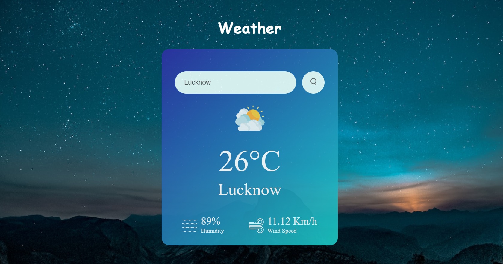

# Weather App 🌦️

## Introduction

This is a simple web-based weather application that allows users to check the weather for a specific city. Users can enter the name of a city, and the application will display the current weather conditions for that city, including Temperature, Humidity, Wind speed, and an icon representing the weather condition.

## Features

- User-friendly Interface.
- Real-time Weather data using the OpenWeatherMap API.
- Displays Temperature, Humidity and Wind Speed
- Weather icons for specific weather conditions (e.g., cloudy, clear, rainy, etc.).
- Error message for Invalid city names.
- Dynamic Background 

## Snap

## Demo

Try this [Weather App](https://alokverma18.github.io/weather-app/) 

## Dependencies

This application uses the OpenWeatherMap API to fetch weather data. You'll need to replace the `apiKey` variable in the JavaScript code with your own API key if you plan to host this application publicly.

## Contributing
Feel free to Contribute and Improve this by creating a Pull Request or an Issue.

## Connect 

## 
### Leave a 🌟 if it was Helpful!!
### Thanks!
